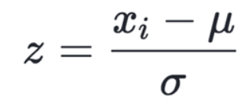

# Feature_Engineering
 - Feature Transformation
 - Feature Construction
 - Feature Selection
 - Feature Extraction

## Feature Transformation 
 - Missing values imputation
 - Handling Categorical Features
 - Outlier Detection
 - Feature Scaling

    1. Missing Values Imputation
        - SciktLearn don't expect missing values
        - Either we need fill or replace or remove
    
    2. Handling Categorical Features
        - SciktLearn handle numerical values
            For ex.:- Dog - 0, Cat - 1 (One-Hot Encoding)
    
    3. Outlier Detection
        - Removal of outlier makes linear best fit line function accurately

    4. Feature Scaling
        - Feature Scaling according range scale (-1 to 1)

## Feature Scaling
- The technique to standardization the independent feature present in datain fixed range.

Why do we need this?
Example - KNN --> Independent variable have different scale not as per the model

### Types of Feature Scaling
1. Standarization (Z-score Normalization) 
2. Normalization 
    - MinMax Scaler
    - Robust Scaler

#### 1. Standardization (Z-score Normalization)

Z-Score = (Current_value - Mean) / Standard Deviation

Standardization performs the following:
- Converts the Mean (μ) to 0
- Converts to S.D. (σ) to 1

It's pretty obvious for Mean = 0 and S.D = 1 as all the values will have such less difference and each value will nearly be equal 0, hence Mean = 0 and S.D. = 1

Varitation in the Standard Deviation
- Standard Deviation > 1 - Squeenze the dataset
- Standard Deviation ~ 0 - Expand the dataset

We have a solution to solve the problem arisen i.e. Standardization. It helps us solve this by : 
- Down Scaling the Values to a scale common to all, usually in the range -1 to +1.
- Keeping the Range between the values intact.

#### 2. Normalization
- The technique often applied as part of data preparation for Machine learning.
- Goal of normalization is to change values of numeric columns in the dataset to use commin scale, without distoring difference in the range of values or losing information.